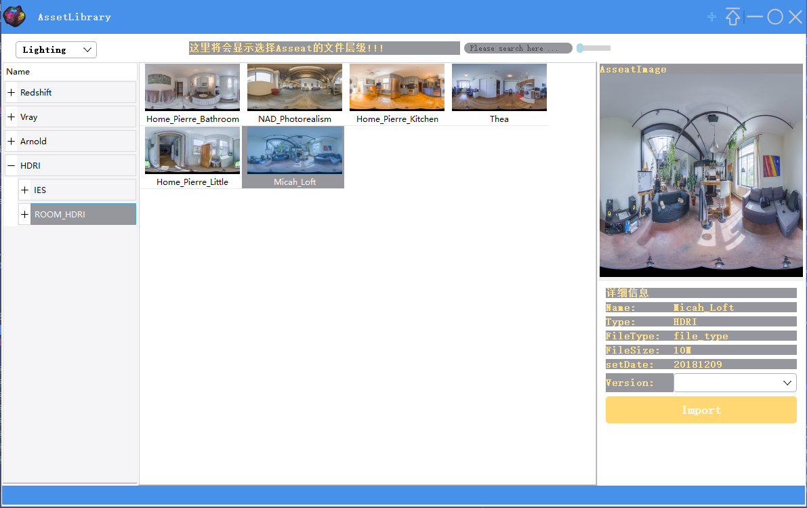
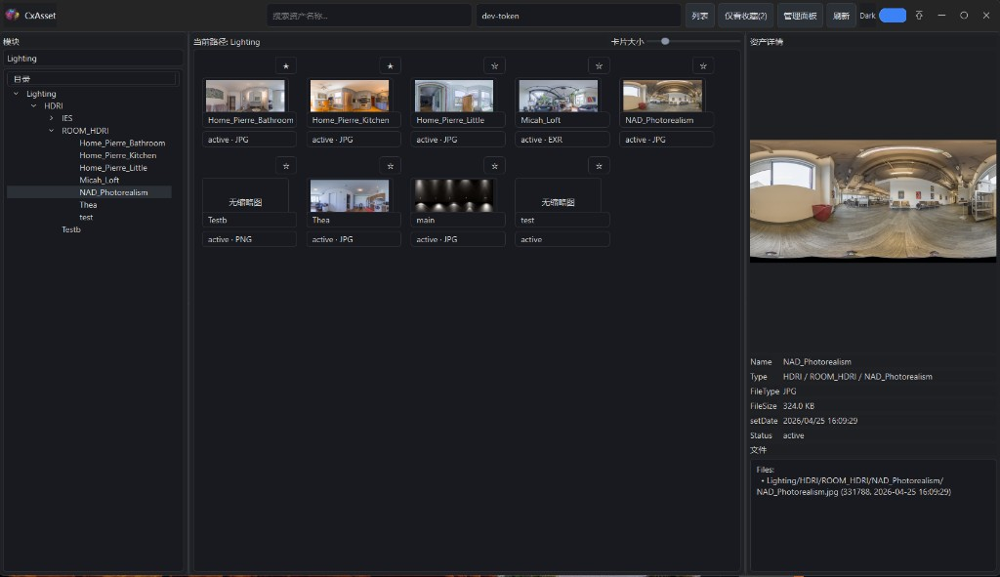
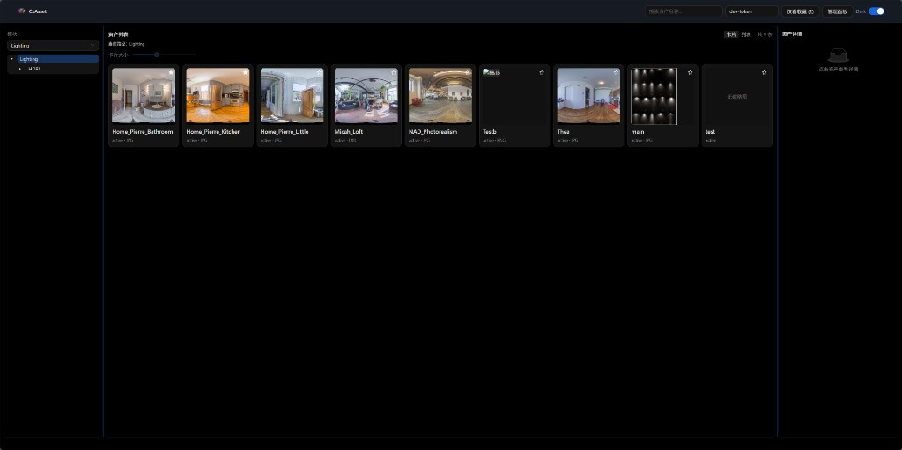

# CxAssetManagementLibrary



管理 CG 资产的 Web + Desktop 双端项目（FastAPI + React + PySide）。

## 当前状态（2026-04）

- Web 与 Desktop 主流程已基本同构：模块树、资产列表、详情预览、管理面板。
- 收藏已改为服务端持久化（`/favorites`），Web 与 Desktop 联动。
- Desktop 支持暗/亮主题切换、边缘拖拽缩放、无边框自定义标题栏。
- 一键启动支持隐藏控制台，并支持三端单独启动脚本。
## 界面对比


### Desktop（图一）



### Web（图二）


## 目录结构（核心）

- 后端：`src/cxasset_api/`
- 前端：`frontend/`
- 桌面端：`src/cxasset_desktop_app/`
- 迁移：`alembic/`
- 一键启动：`start_project.bat`
- 一键停止：`stop_project.bat`
- 单端启动：`start_backend.bat` / `start_frontend.bat` / `start_desktop.bat`

## 数据库路径


- `data/cxasset.db`

对应配置：

- `src/cxasset_api/config.py` -> `database_url = sqlite:///./data/cxasset.db`
- `alembic.ini` -> `sqlalchemy.url = sqlite:///./data/cxasset.db`

`start_project.bat` 会自动：

1. 创建 `data/` 目录
2. 若检测到旧库 `./cxasset.db` 且 `./data/cxasset.db` 不存在，则自动迁移

## 快速启动

### 一键启动（推荐）

```bat
start_project.bat
```

脚本内可调变量（文件顶部）：

- `SHOW_SERVICE_CONSOLES=0/1`：是否显示后端/前端控制台
- `PREPARE_DEPENDENCIES=0/1`：是否自动安装依赖与执行迁移
- `START_BACKEND=0/1`
- `START_FRONTEND=0/1`
- `START_DESKTOP=0/1`

### 单端启动

```bat
start_backend.bat 0
start_frontend.bat 0
start_desktop.bat 0
```

- 参数 `0`：隐藏控制台（日志写入 `logs/`）
- 参数 `1`：显示控制台

### 一键停止

```bat
stop_project.bat
```

会停止：
- 后端（8000 端口）
- 前端（5173 端口）
- 桌面端（`run_desktop.py` 对应 python/pythonw 进程）


## API 检查

- `GET /health`
- `GET /version`
- `GET /metrics`
- `GET /libraries`
- `GET /libraries/{library_id}/tree`
- `GET /libraries/{library_id}/assets`
- `GET /assets/{asset_id}`
- `GET /favorites` / `POST /favorites/{asset_id}` / `DELETE /favorites/{asset_id}`


## 说明

- `third_party/dayu_widgets` 为源码依赖目录（非标准 pip 包），项目会从该目录加载主题组件。
- 旧桌面目录（`CXA_UI` / `CXA_UIPY` / `CXA_Script`）保留为历史参考，新版入口为 `run_desktop.py`。
